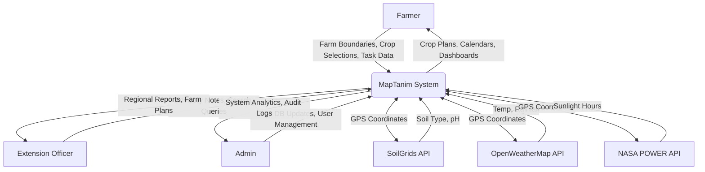
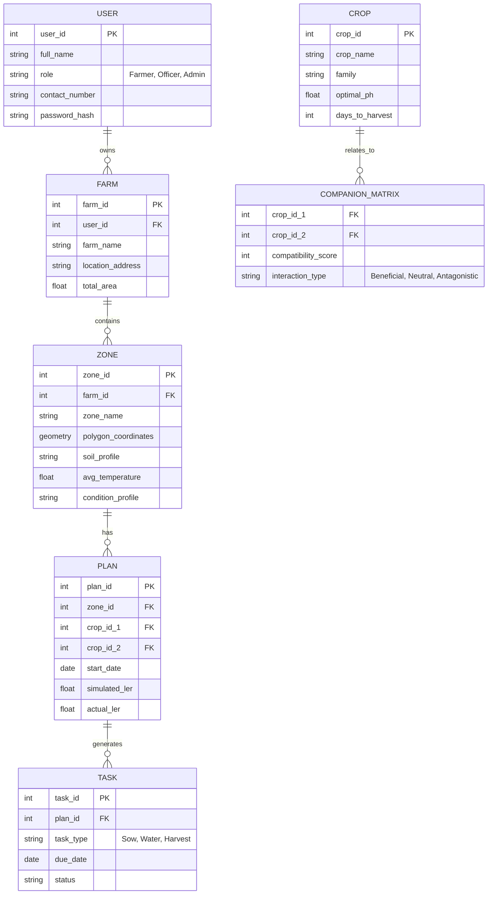

# MapTanim: System Architecture & Design Documentation

This document provides a comprehensive breakdown of the conceptual, architectural, and system design components for **MapTanim**, a Web and Mobile-Based Geo-Mapping-Driven Inter-cropping Planning, Farm Management, and Agricultural Decision Support Platform.

---

## 1. Conceptual Framework

MapTanim follows an **Input-Process-Output-Feedback (IPOF)** framework, designed to transform user inputs and environmental data into actionable agroecological guidance.

*   **Inputs:**
    *   **Farmer Data:** Drawn polygon zone boundaries, selected vegetable crops, growth stage observations, harvest weights, issue flags, worker assignments, and community posts.
    *   **System-Retrieved Data:** Soil type, pH, drainage class (SoilGrids API); Temperature, rainfall (OpenWeatherMap API); Average daily sunlight (NASA POWER API).
*   **Processes:**
    *   **Classification:** Automatic zone condition classification (mapping to 9 standardized biophysical profiles).
    *   **Rule Engine:** Agroecological rule engine scoring (0-100 match score for crop pairs).
    *   **Layout & Simulation:** Strategic layout generation and Land Equivalent Ratio (LER) simulation.
    *   **Calendar Generation:** Automated planting, fertilizing, and harvesting calendar derivation.
*   **Outputs:**
    *   Ranked, zone-specific crop pair recommendations.
    *   Auto-generated planting calendar and task reminders.
    *   Drag-and-drop strategic layouts with productivity heatmaps.
    *   Simulated and actual LER values and a farm analytics dashboard.
*   **Feedback:**
    *   Continuous farmer input on crop health and actual harvest yields to refine accuracy.
    *   System Usability Scale (SUS) survey data and error rate collection.

---

## 2. System Architecture

MapTanim employs a **Client-Server Architecture** optimized for resource-constrained environments. 
*   **Client Tier:** A Progressive Web Application (PWA) that provides native-like mobile experiences directly in the browser, featuring offline caching capabilities for areas with intermittent connectivity.
*   **Application Tier (Backend):** A centralized RESTful API that handles business logic, the agroecological rule engine, and integration with third-party environmental APIs.
*   **Data Tier:** A spatial database management system capable of storing relational data alongside geospatial polygons.

---

## 3. Hardware Architecture

The hardware architecture relies on cloud-based deployment to ensure high availability and scalability, minimizing the hardware burden on end-users.
*   **Server-Side:** Cloud-hosted virtual machines (e.g., AWS EC2 or Google Compute Engine) housing the application server and database server.
*   **Client-Side (Farmers):** Low-cost Android or iOS smartphones equipped with GPS modules for field mapping and a web browser.
*   **Client-Side (Admins/Extension Officers):** Standard desktop or laptop computers for viewing comprehensive dashboards and analytics.

---

## 4. Software Architecture

MapTanim utilizes a **Modular Monolithic** software architecture. This approach provides a unified codebase for simpler deployment while maintaining logical separation of the 15 distinct functional phases.
*   **Frontend:** Built using modern web technologies that compile into a PWA (Service Workers, Web App Manifest).
*   **Backend:** Event-driven, non-blocking I/O server handling API requests, executing the Rule Engine, and returning JSON responses.
*   **GIS Engine:** Geospatial libraries integrated into the frontend (for map rendering and polygon drawing) and backend (for spatial queries).

---

## 5. Network Architecture

The network architecture is designed for security and reliability over varying connection qualities (3G/4G/Wi-Fi).
*   Clients communicate with the MapTanim cloud server via standard Internet protocols utilizing **HTTPS/TLS 1.2+** for encrypted data transmission.
*   A Cloud Load Balancer routes incoming traffic to the appropriate web server instances.
*   The MapTanim backend communicates securely over the internet to fetch data from the SoilGrids, OpenWeatherMap, and NASA POWER APIs.

---

## 6. Database Architecture

To accommodate the geospatial requirements of polygon zone drawing, MapTanim uses an **Object-Relational Database with Spatial Extensions** (e.g., PostgreSQL with PostGIS).
*   **Spatial Data:** Stores farm boundaries and zones as geometric/geographic polygon data types, allowing for area calculation and spatial indexing.
*   **Relational Data:** Manages users, roles, crop libraries, companion planting matrices, task logs, and harvest records with strict referential integrity.

---

## 7. Application / Module Architecture

The system is compartmentalized into specific functional modules corresponding to the 15 phases:
1.  **Auth & Onboarding Module:** Profile creation, role assignment, interactive tutorials.
2.  **GIS Mapping Module:** Satellite map interface, polygon drawing, API data aggregation for zones.
3.  **Agroecological Rule Engine Module:** Crop compatibility scoring, LER simulation, recommendation generation.
4.  **Farm Management Module:** Task scheduling, activity logs, harvest logging, worker management.
5.  **Analytics & Dashboard Module:** Financial projections, LER metrics, zone performance reporting.
6.  **Collaboration & Community Module:** Messaging, community forums, knowledge sharing.

---

## 8. Security Architecture

*   **Authentication:** JSON Web Tokens (JWT) for secure, stateless user sessions.
*   **Authorization:** Role-Based Access Control (RBAC) enforcing strict data access boundaries between Farmers, Extension Officers, and Admins.
*   **Data Protection:** Passwords hashed using Bcrypt. All data in transit is encrypted via SSL/HTTPS.
*   **API Security:** Backend endpoints are protected with rate-limiting to prevent DDoS attacks. Third-party API keys are stored securely in backend environment variables, never exposed to the client.

---

## 9. Respondents / System Users

1.  **Farmers (Primary Users):** Smallholder vegetable farmers using the mobile PWA to map zones, get intercropping recommendations, and track tasks/harvests. Features a simplified, pictogram-heavy UI mode.
2.  **Extension Officers (Secondary Users):** Agricultural advisors who monitor regional farmer plans, provide advisory notes, and track the adoption of agroecological practices.
3.  **Administrators:** System managers responsible for maintaining the crop library, managing users, and viewing platform-wide analytics.

---

## 10. Hardware and Software Requirements

### Hardware Specifications
*   **Client (Farmer):** Android or iOS Smartphone (Minimum: 2GB RAM, GPS Enabled, 4G/3G connectivity).
*   **Client (Admin/Officer):** Desktop/Laptop (Minimum: Intel Core i3 / AMD Ryzen 3, 4GB RAM).
*   **Server (Cloud Hosting):** Minimum 4 vCPUs, 8GB RAM, 100GB SSD Storage (Scalable based on user load).

### Software Requirements
*   **Client Environment:** Modern Web Browser (Google Chrome, Safari, Mozilla Firefox) with Service Worker support for PWA features.
*   **Server Environment:** Linux OS (Ubuntu 22.04 LTS or similar).
*   **Database Engine:** PostgreSQL (v14+) with PostGIS extension.

---

## 11. Development Tools

*   **IDE/Editor:** Visual Studio Code.
*   **Version Control:** Git & GitHub / GitLab.
*   **API Testing:** Postman or Insomnia.
*   **Design & Prototyping:** Figma (for UI/UX and pictogram design).
*   **Containerization:** Docker (for consistent local development and deployment).

---

## 12. Frameworks and Technologies

*   **Frontend Framework:** React.js or Next.js (ideal for building fast, responsive PWAs).
*   **Mapping Library:** Leaflet.js or Mapbox GL JS for rendering satellite maps and drawing polygons.
*   **Backend Framework:** Node.js with Express.js (or Python with Django/FastAPI, highly suitable for data and GIS processing).
*   **Styling:** Tailwind CSS (for rapid, responsive UI development).

---

## 13. System Design

The system design relies on **User-Centered Design (UCD)** principles specifically tailored for low digital literacy users. This includes:
*   **Pictogram-First UI:** Utilizing intuitive icons over heavy text to explain crop compatibility and farm tasks.
*   **Progressive Disclosure:** Hiding complex analytics behind simpler summaries, allowing farmers to dig deeper only if they choose.
*   **Offline-Tolerance:** Designing data submission forms that can queue offline and sync when a connection is restored.

---

## 14. Use Case Diagram

```mermaid
usecaseDiagram
    actor Farmer
    actor ExtensionOfficer as Extension Officer
    actor Administrator as Admin

    package "MapTanim System" {
        usecase "Manage Farm Profile" as UC1
        usecase "Draw Field Zones (GIS)" as UC2
        usecase "Get Intercropping Recommendations" as UC3
        usecase "Manage Farm Tasks & Calendar" as UC4
        usecase "Log Harvest & Yield" as UC5
        usecase "Monitor Regional Farms" as UC6
        usecase "Provide Advisory Notes" as UC7
        usecase "Manage Crop Library & Rules" as UC8
        usecase "View System Analytics" as UC9
    }

    Farmer --> UC1
    Farmer --> UC2
    Farmer --> UC3
    Farmer --> UC4
    Farmer --> UC5

    ExtensionOfficer --> UC6
    ExtensionOfficer --> UC7

    Admin --> UC8
    Admin --> UC9
```

---

## 15. Data Flow Diagram (DFD)

### Level 0: Context Diagram



---

## 16. Entity-Relationship Diagram (ERD)


